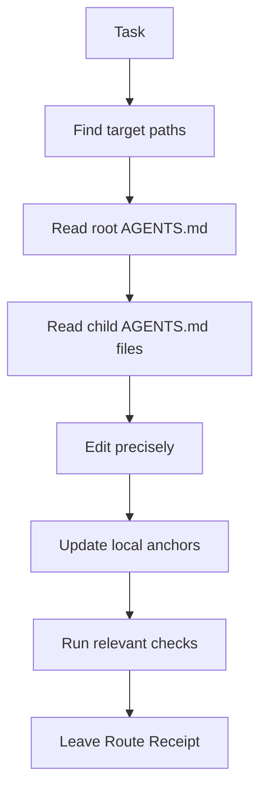

<!--
Rootline README maintainer note:
Keep the public story here. Keep agent-operating rules in AGENTS.md.
-->

<p align="center">
  <code>AGENTS.md</code>
  <code>Apache-2.0</code>
  <code>v0.1.1</code>
  <code>runtime:none</code>
</p>

<h1 align="center">Rootline</h1>

<p align="center">
  <strong>A route-aware AGENTS.md protocol for AI agents.</strong><br>
  <sub>Read the route. Edit the work. Leave the receipt.</sub>
</p>

<p align="center">
  <a href="#how-rootline-works">How it works</a>
  |
  <a href="#how-to-use">How to use</a>
  |
  <a href="#why-rootline-is-different">Why different</a>
  |
  <a href="#changelog">Changelog</a>
  |
  <a href="#contributing">Contributing</a>
  |
  <a href="#security">Security</a>
  |
  <a href="#license">License</a>
  |
  <a href="#credits">Credits</a>
</p>

<details>
<summary><strong>Contents</strong></summary>

- [How Rootline works](#how-rootline-works)
- [How to use](#how-to-use)
- [The Rootline primitives](#the-rootline-primitives)
- [Why Rootline is different](#why-rootline-is-different)
- [Compatibility notes](#compatibility-notes)
- [Install checklist](#install-checklist)
- [Changelog](#changelog)
- [Contributing](#contributing)
- [Security](#security)
- [License](#license)
- [Credits](#credits)

</details>

## How Rootline works

Rootline is a lightweight `AGENTS.md` protocol for AI agents.

> [!NOTE]
> Rootline is only Markdown. No package. No daemon. No lock-in. The discipline is in the file.

It gives an agent a route through project instructions before the agent edits
files, then asks for a route receipt after the edit. That makes the agent answer
four questions every time:

| Question | Rootline answer |
| --- | --- |
| What rules apply here? | Read the root doc and every child doc on the path to the work. |
| Where does local context live? | Keep durable guidance in the nearest local anchor. |
| When should docs change? | Update docs when structure, commands, ownership, workflow, or preferences change. |
| How do we know it followed the route? | Close with a Route Receipt. |



> [!TIP]
> The core move is not "make more docs." The core move is "put the right rule near the place it governs."

---

## How to use

<kbd>Step 1</kbd> Copy [AGENTS.md](./AGENTS.md) into the root of a project.

<details open>
<summary><strong>macOS / Linux</strong></summary>

```sh
cp AGENTS.md /path/to/project/AGENTS.md
```

</details>

<details>
<summary><strong>Windows PowerShell</strong></summary>

```powershell
Copy-Item .\AGENTS.md X:\path\to\project\AGENTS.md
```

</details>

<details>
<summary><strong>Direct from GitHub</strong></summary>

```sh
curl -fsSL https://raw.githubusercontent.com/AdrianParedez/rootline/v0.1.1/AGENTS.md -o /path/to/project/AGENTS.md
```

```powershell
Invoke-WebRequest `
  -Uri "https://raw.githubusercontent.com/AdrianParedez/rootline/v0.1.1/AGENTS.md" `
  -OutFile "X:\path\to\project\AGENTS.md"
```

</details>

<kbd>Step 2</kbd> Ask an agent to install the project facts.

```text
Install Rootline for this project.
Read the repository, keep AGENTS.md concise, and only add child docs where stable local guidance exists.
```

<kbd>Step 3</kbd> Use the receipt on every meaningful change.

```text
Rootline receipt:
- Route read: AGENTS.md
- Docs updated: AGENTS.md
- Checks run: reviewed headings and Route Map
- Gaps: no child docs exist yet
```

<details>
<summary><strong>For an existing project</strong></summary>

Ask the agent to inspect the repository first, then create only the docs that
earn their keep:

```text
Initialize Rootline in this existing project.
Create a root AGENTS.md.
Add child AGENTS.md files only for durable boundaries with distinct commands, ownership, or rules.
Leave a Rootline receipt listing what you read, created, skipped, and verified.
```

</details>

<details>
<summary><strong>For a new project</strong></summary>

Start with one root file. Let child docs appear only when the project develops
real local rules:

- Add root `AGENTS.md`.
- Fill in project commands once they exist.
- Leave `Operator Profile` empty until durable preferences are known.
- Keep the `Route Map` honest.

</details>

---

## The Rootline primitives

| Primitive | What it does | Why it matters |
| --- | --- | --- |
| Route Brief | States scope, route, local anchor, drift trigger, and receipt rule. | Prevents vague "read docs first" instructions. |
| Route Protocol | Defines how the agent finds and composes applicable instructions. | Makes routing explicit before any edit happens. |
| Local Anchor | Stores local facts near the files they govern. | Reduces root bloat and stale global rules. |
| Drift Control | Updates Rootline docs only when durable guidance changes. | Keeps docs current without turning them into task logs. |
| Route Receipt | Records route read, docs updated, checks run, and gaps. | Turns agent compliance into something reviewable. |
| Operator Profile | Starts empty, then captures durable operator/team preferences after install. | Keeps the starter universal without losing customisation. |
| Route Map | Lists known child instruction files. | Lets agents route quickly without pretending the map is proof. |

<details>
<summary><strong>Route Brief template</strong></summary>

```markdown
## Route Brief

- Scope:
- Route:
- Local anchor:
- Drift trigger:
- Receipt:
```

</details>

---

## Why Rootline is different

Rootline is intentionally not just a self-documenting tree. It is a small
operating pattern for agent accountability.

| Pattern | Default behaviour |
| --- | --- |
| Plain `AGENTS.md` | Gives the agent repo instructions. |
| Self-documenting tree | Builds and maintains a hierarchy of `AGENTS.md` files. |
| Rootline | Builds a route, edits under that route, and leaves a receipt. |

Rootline's unique stance:

- The Route Map is a guide, not proof.
- The Local Anchor owns local guidance.
- The root should stay thin.
- Child docs should earn their existence.
- Drift Control updates docs only when future work changes.
- Every meaningful edit ends with a Route Receipt.

> [!IMPORTANT]
> Rootline should make future work easier to route. If a new rule does not help a future agent decide what to read, where to edit, or how to verify, it probably does not belong in `AGENTS.md`.

---

## Compatibility notes

Rootline is written in plain Markdown, so it can be read by any tool that can load
repository instruction files.

Compatibility notes are informational. Check the linked tool documentation before
publishing or changing tool-specific claims.

| Tool | Rootline path |
| --- | --- |
| [Codex](https://developers.openai.com/codex/guides/agents-md) | Uses `AGENTS.md` directly. |
| [GitHub Copilot](https://docs.github.com/en/copilot/how-tos/copilot-on-github/customize-copilot/add-custom-instructions/add-repository-instructions) | Supports `AGENTS.md` files in the repository tree. |
| [VS Code agent customizations](https://code.visualstudio.com/docs/agent-customization/overview) | Can load `AGENTS.md` as always-on workspace instructions. |
| [OpenCode](https://opencode.ai/docs/rules/) | Uses `AGENTS.md` and can improve one through `/init`. |
| [Claude Code](https://code.claude.com/docs/en/memory) | Use `CLAUDE.md` with `@AGENTS.md`, or a symlink where appropriate. |

```md
<!-- CLAUDE.md bridge -->
@AGENTS.md
```

<sub>Different tools load instruction files differently. Rootline stays portable by keeping the file plain, concise, and explicit.</sub>

---

## Install checklist

- [ ] Add root `AGENTS.md`.
- [ ] Fill in project commands that actually exist.
- [ ] Leave `Operator Profile` empty until durable preferences are known.
- [ ] Add child docs only where local rules differ.
- [ ] Update the `Route Map` when child docs are added, moved, or removed.
- [ ] Ask the agent to leave a Route Receipt after the first change.

---

## Changelog

Current protocol version: `0.1.1`.

See [CHANGELOG.md](./CHANGELOG.md) for release notes.

---

## Contributing

See [CONTRIBUTING.md](./CONTRIBUTING.md) for contribution guidance.

---

## Security

See [SECURITY.md](./SECURITY.md) for security-sensitive reporting guidance.

---

## License

Rootline is licensed under the Apache License, Version 2.0. See
[LICENSE](./LICENSE).

---

## Credits

Created by Adrian Paredez.

Rootline exists because AI agents do better when project context is close,
current, and reviewable.[^1]

[^1]: "Reviewable" means a human can see which route the agent read, what docs it updated, and what checks it ran.
